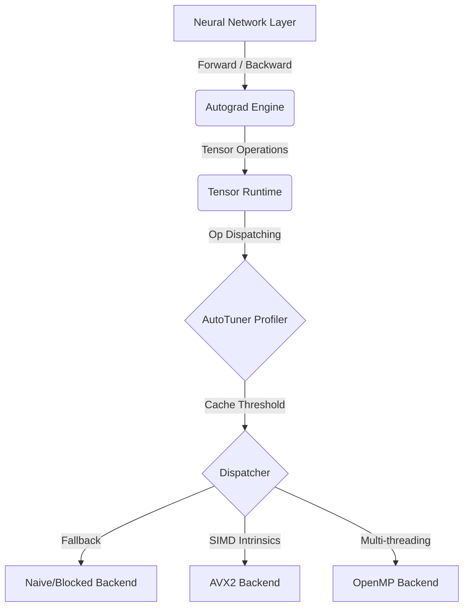

# HELIX: Deep Learning Framework in Modern C++

HELIX is a Deep Learning Framework built entirely from scratch in C++20. The project's goal is to research and master the core technologies underneath massive frameworks like PyTorch or TensorFlow, including: Tensor Runtime, Reverse-mode Automatic Differentiation (Autograd), and computational optimization (SIMD/OpenMP).

## 🌟 Key Features

- **Tensor Runtime**: Supports n-dimensional arrays, Zero-memory Broadcasting, View Operations (`reshape`, `transpose`) with $O(1)$ latency, and a **Chunked Iterator** for SIMD/OpenMP optimized element-wise iteration.
- **Dynamic Autograd**: Dynamic Computational Graph (Define-by-Run). Automatically analyzes Topology, guards against stride overlaps, and computes gradients with In-place Accumulation to optimize RAM.
- **Neural Network Core**: Clean and extensible API. Supports `Module`, `Linear`, `Sequential`, Activation functions (`ReLU`, `Sigmoid`), Optimizers (`SGD`), and Loss functions (`MSE`, `CrossEntropyLoss`).
- **High-Performance Backends**:
  - `Naive`: Absolute baseline for correctness.
  - `Blocked`: Memory Access Pattern optimization (Cache Tiling).
  - `SIMD AVX2`: Hardware instruction-level optimization (`4x16` Outer Product via 256-bit YMM).
  - `OpenMP`: Multi-threading level optimization.
  - `AutoTuner`: JIT Hardware Profiler (Lazy Eval & Explicit Init) to auto-detect the optimal OpenMP Threading threshold.

---

## 🏛 Overall Architecture

HELIX's architecture is divided into 4 independent layers to ensure Scalability and Maintainability.


```mermaid
graph TD
    A[Neural Network Layer] -->|Forward / Backward| B(Autograd Engine)
    B -->|Tensor Operations| C(Tensor Runtime)
    C -->|Op Dispatching| J{AutoTuner Profiler}
    J -->|Cache Threshold| D{Dispatcher}
    
    D -->|Fallback| E[Naive/Blocked Backend]
    D -->|SIMD Intrinsics| G[AVX2 Backend]
    D -->|Multi-threading| H[OpenMP Backend]
```

To better understand **Why** we decided on this design (Why use a Dispatcher? Why use Dynamic Graphs instead of Static?), read the [Design Decisions](docs/design_decisions.md) and [Architecture](docs/architecture.md) documents.

---

## 🚀 Quick Start

### System Requirements

- C++20 Compiler (GCC 10+, Clang 11+).
- CMake 3.20 or newer.
- (Optional) AVX2 supported CPU to utilize the SIMD Backend.

### Build

The project comes with an automation script to simplify the build process:

```bash
# Clone repository
git clone https://github.com/minhduc5a15/HELIX.git
cd HELIX

# Build with Release mode and architecture optimization (Native)
./build.sh --release

# Run all Unit Tests
./run_tests.sh
```

---

## 💡 Minimal Working Example

To build and train a Neural Network model, HELIX's API is designed to closely resemble PyTorch to provide maximum familiarity.

```cpp
#include "helix.hpp"
using namespace helix;

int main() {
    // 1. Initialize Neural Network model
    auto model = nn::Sequential({
        std::make_shared<nn::Linear>(2, 16),
        std::make_shared<nn::ReLU>(),
        std::make_shared<nn::Linear>(16, 1)
    });

    // 2. Define Optimizer
    optim::SGD optimizer(model->parameters(), 0.01);

    // 3. Prepare Data (Inputs) and Labels (Targets)
    auto inputs = Tensor({{0, 0}, {0, 1}, {1, 0}, {1, 1}}, Shape{4, 2});
    auto targets = Tensor({{0}, {1}, {1}, {0}}, Shape{4, 1});

    // 4. Training Loop
    for (int epoch = 0; epoch < 1000; ++epoch) {
        optimizer.zero_grad();                 // Clear previous gradients

        auto outputs = model->forward(inputs); // Forward Pass
        auto loss = mse_loss(outputs, targets); // Compute Loss

        loss.backward();                     // Backpropagation (Backward Pass)
        optimizer.step();                    // Update weights
    }

    return 0;
}
```

### End-to-End Image Classification (MNIST)

HELIX is capable of training realistic datasets like MNIST using its high-performance CPU backend and CrossEntropyLoss. You can run the provided example to see it in action (reaches ~97% accuracy in < 30 seconds):

```bash
# 1. Download and extract the MNIST dataset (requires wget and gzip)
bash scripts/download_mnist.sh

# 2. Build the MNIST example
./build.sh

# 3. Run the training loop
./out/build/HELIX/examples/mnist
```

---

## 📊 Performance (Benchmark)

HELIX comes with a Benchmark system to measure the limits of Tensor algorithms.
For the **Matrix Multiplication (1024x1024)** operation, the SIMD (AVX2) and OpenMP Backends show incredible superiority over traditional algorithms:


```text
Naive (1.47 GFLOPS)
██

Blocked (14.43 GFLOPS)
██▎

AVX2 (41.08 GFLOPS)
██████████████████████████████

OpenMP (128.09 GFLOPS)
██████████████████████████████████████████████████████████████████████████████
```

👉 See the full bottleneck analysis report at [Benchmark Report](docs/benchmark_report.md).

---

## 📚 Additional Documentation

Please browse the `docs/` directory to read in-depth documents for developers:

- [Architecture Guide](docs/architecture.md): System diagram.
- [Design Decisions](docs/design_decisions.md): Core design decisions.
- [Developer Guide](docs/developer_guide.md): Guide to extending HELIX (Adding NN Layers, Activation Functions, Backends).
- [API Reference](docs/api_output/html/index.html): API documentation generated by Doxygen (Requires Doxygen configuration).
- [Coding Convention](docs/coding_convention.md): Source code standards for submitting Pull Requests.

---

> _"What I cannot create, I do not understand." - Richard Feynman_
