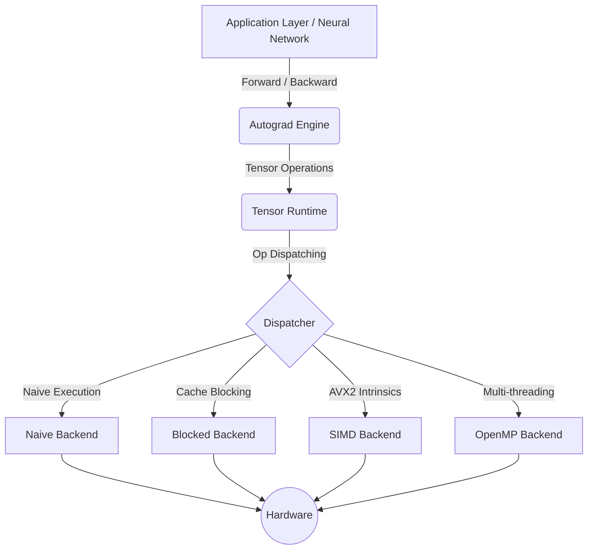

# Overall Architecture

This document provides a high-level overview of how HELIX is designed and the main data flows within the Framework. If you want to understand **why** these components were chosen, please refer to the [Design Decisions](design_decisions.md) document.

## System Diagram

HELIX is designed with a strict layered architecture. Each layer only communicates with the layer immediately below it.

---

## Architecture Layers

### 1. Neural Network Core (Application Layer)
This is the top layer, providing the API for users to build Deep Learning models.
- **Module:** Base class for all Neural Network components.
- **Layer:** Contains weights (Weights/Biases) and performs transformations (e.g., `Linear`, `ReLU`).
- **Sequential:** A container that allows stacking Layers sequentially.
- **Optimizer & Loss:** Defines the objective function (`MSELoss`) and how to update weights (`SGD`).

### 2. Autograd Engine (Automatic Differentiation)
Responsible for tracking computation history and automatically computing derivatives based on the Chain Rule.
- **Dynamic Computational Graph:** The computation graph is built dynamically whenever a Forward operation is performed.
- **Node:** Each `Tensor` generated by an operation is accompanied by a `Node` storing that operation and its parent `Tensor`s.
- **Backward Propagation:** When calling `loss.backward()`, the system performs a Topological Sort of the Nodes from Loss back to Input to compute Gradients.

### 3. Tensor Runtime (Computation Layer)
The central layer containing all definitions for the Tensor data structure.
- **Data & Shape:** Manages the memory space (Storage) of multi-dimensional real numbers.
- **View Operations:** Provides zero-copy View mechanisms (Strided memory) for `reshape`, `transpose`, `flatten`.
- **Broadcasting:** Automatically adjusts the dimensions of two Tensors with different Shapes to perform operations (O(1) memory overhead thanks to Stride adjustment).

### 4. Dispatcher & Backend (Core Optimization Layer)
Instead of executing operations directly within `Tensor`, the Tensor Runtime delegates calculations to the `Dispatcher`.
- **CPU Backend Dispatcher:** Acts as a traffic controller, checking configurations (`MatMulConfig`, `AVX2 Support`) and choosing the most appropriate Backend.
- **Backend Implementations:** Provides MatMul (Matrix Multiplication) and Element-wise vector computations optimized for various scenarios:
  - `Naive`: Baseline for correctness comparison.
  - `Blocked`: Buffer optimization (Cache Tiling).
  - `AVX2 (SIMD)`: Hardware instruction level optimization with 256-bit YMM registers.
  - `OpenMP`: Thread level optimization (Multi-threading).

---

## Execution Flow

Example when calling: `C = A + B`

1. **Initialization:** `C` is created in the `Tensor Runtime` with a Shape dependent on the Broadcast result of `A` and `B`.
2. **Execution:** The `Dispatcher` receives a request to add two memory regions and selects the `SIMD Backend` (if the CPU supports AVX2) or falls back to a standard loop.
3. **Recording (Autograd):** If `A` or `B` requires a gradient (`requires_grad = true`), an `AddNode` is generated and attached to `C.grad_fn()`.
4. **Returning Result:** `C` is returned to the user. When the user calls `C.backward()`, the `AddNode` will propagate the derivative back to `A` and `B`.
