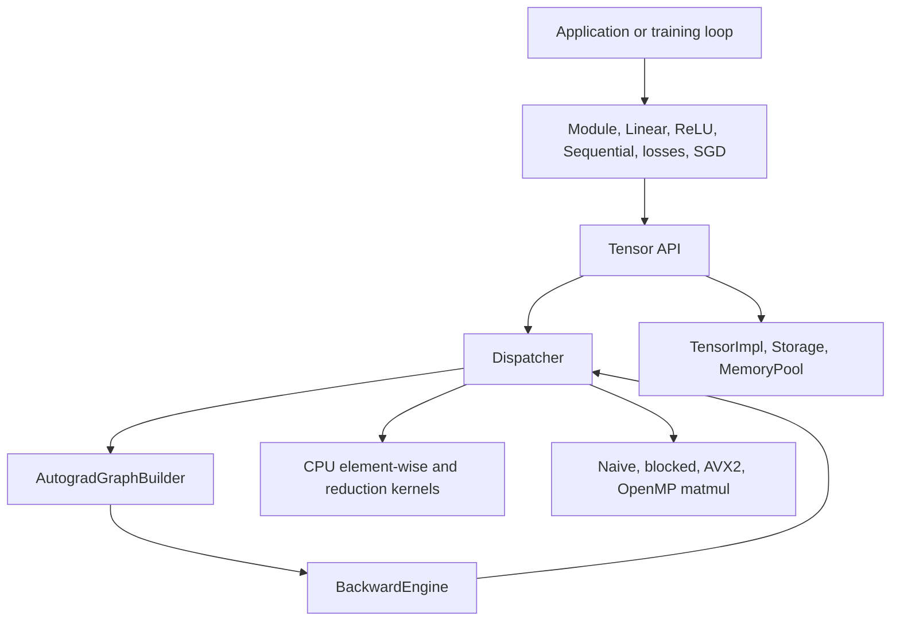

# Architecture

This document describes the code that is currently built by the root `CMakeLists.txt`. It deliberately distinguishes implemented behavior from extension points.

## Component map

```mermaid
flowchart TD
    Application[Application or training loop]
    NN[Module, Linear, ReLU, Sequential, losses, SGD]
    Tensor[Tensor API]
    Dispatcher[Dispatcher]
    GraphBuilder[AutogradGraphBuilder]
    Engine[BackwardEngine]
    Elementwise[CPU element-wise and reduction kernels]
    Matmul[Naive, blocked, AVX2, OpenMP matmul]
    Runtime[TensorImpl, Storage, MemoryPool]

    Application --> NN
    NN --> Tensor
    Tensor --> Dispatcher
    Tensor --> Runtime
    Dispatcher --> Elementwise
    Dispatcher --> Matmul
    Dispatcher --> GraphBuilder
    GraphBuilder --> Engine
    Engine --> Dispatcher
```

The boundaries are useful design boundaries rather than strictly isolated layers. For example, the Dispatcher invokes the graph-builder interface after a forward operation, and backward functions reuse Dispatcher operations while graph recording is temporarily disabled.

## Tensor runtime

`Tensor` is a value-like handle around a shared `TensorImpl`. A `TensorImpl` stores a shared `Storage`, a storage offset, shape, stride, dtype, device metadata, and optional autograd metadata.

A normal C++ copy of a `Tensor` is shallow. `clone()` creates independent dense storage. The following operations can share storage with their input:

- `view`, when the input is contiguous;
- `slice`;
- `transpose`;
- `broadcast_to`, using zero strides for expanded dimensions;
- `detach`, which shares storage but omits autograd history.

`reshape` returns a view for contiguous inputs and performs `clone().view(...)` for non-contiguous inputs. `flatten` delegates to `reshape`, so it has the same behavior.

The runtime supports `Float32`, `Float64`, `Int32`, and `Int64`. Binary operations apply the promotion rules in `core/dtype.hpp`; division, means, and transcendental functions promote integer input to floating point.

Storage allocation uses a 32-byte-aligned caching pool. Each thread has a local cache for common allocation and deallocation paths. Global size bins, protected by per-bin mutexes, handle cache refills and cross-thread returns. `reset()` advances an epoch so active thread caches can release cached blocks lazily. The process-wide pool object intentionally lives for the process lifetime to avoid teardown ordering problems with thread-local destructors.

## Iteration and layout handling

Dense element-wise operations take a contiguous fast path. General binary operations use `TensorIterator`, which computes broadcast strides, coalesces compatible adjacent dimensions, and can divide traversal into OpenMP chunks. Its generic traversal supports at most eight dimensions and eight total operands. The dense fast path is evaluated before constructing the iterator and therefore does not inherit the iterator's rank limit.

`NDIterator` and `BinaryNDIterator` still provide fallback traversal for several clone, copy, zeroing, in-place, and optimizer paths. They have not been removed from the codebase.

Before mutating a view, HELIX rejects layouts that its overlap heuristic identifies as mapping multiple logical elements to the same storage location. This is a conservative safety check and can report overlap for some layouts that are actually safe.

## Dispatcher and CPU backends

The `Dispatcher` owns forward-operation policy:

1. validate supported shapes where the operation provides validation;
2. compute broadcast shape and promoted dtype;
3. create views or contiguous copies required by the kernel;
4. invoke a CPU kernel;
5. pass an `OperationContext` to the registered graph builder.

Element-wise float kernels use AVX2 implementations where `CPUBackend` provides them and runtime support is reported. Other dtype and layout combinations use scalar, compiler-vectorized, or iterator-based paths.

Float 2D matrix multiplication supports explicit naive, blocked, AVX2, and OpenMP strategies. In automatic mode:

- without OpenMP, it selects AVX2 when supported and blocked otherwise;
- with OpenMP, `AutoTuner` selects an OpenMP threshold by comparing the AVX2 and OpenMP kernels at fixed 256 and 512 square sizes;
- the selected threshold is cached in `.helix_autotune` in the process working directory.

Non-`Float32` matrix multiplication uses the generic blocked implementation. Matrix multiplication currently supports only two-dimensional inputs.

Although `DeviceType::CUDA` exists, allocation and execution for CUDA are not implemented. Execution methods route supported work to CPU kernels and generally reject a non-CPU execution device; CUDA metadata must not be treated as a usable backend.

## Autograd

Autograd is registered explicitly through `init_autograd()`. The registration supplies two objects to the tensor runtime:

- an `AutogradProvider`, which owns backward execution and leaf-gradient access;
- an `AutogradGraphBuilder`, which translates a forward `OperationContext` into a backward `Node`.

When at least one input requires gradients, the graph builder creates the matching backward node, connects it to input nodes or leaf `AccumulateGrad` nodes, and attaches it to the output.

`SavedTensor` shares the saved value's storage without retaining its autograd history and records the storage version. Backward raises an error if an in-place operation changed a saved storage after the forward pass. `AccumulateGrad` keeps a `weak_ptr` to leaf metadata so destroying a leaf before backward does not leave a dangling pointer.

`BackwardEngine` computes graph in-degrees, processes ready nodes in topological order, and sums gradients arriving from multiple branches. Graph recording is disabled during this work. Unless `retain_graph` is true, it clears node edges after the pass; a second backward through the cleared graph is rejected.

## Neural-network layer

The current high-level components are:

- `Module`, with `forward`, `named_parameters`, and `parameters`;
- `Linear`, storing a `[in_features, out_features]` weight and a bias;
- `ReLU`;
- `Sequential`;
- free functions `mse_loss` and `cross_entropy_loss`;
- `SGD`, without momentum or weight decay.

`cross_entropy_loss` accepts logits and one-hot targets of identical `[batch, classes]` shape. Its kernel computes log-softmax with the log-sum-exp stabilization and returns the mean batch loss.

## Example data flow

For `Tensor c = a + b`:

1. the Dispatcher computes a broadcast output shape and common dtype;
2. it creates zero-stride broadcast views as needed;
3. a dense kernel or `TensorIterator` writes `c`;
4. if either input requires gradients, `AutogradGraphBuilder` attaches `AddBackward` to `c`;
5. during backward, `AddBackward` reduces the incoming gradient back to each original input shape before passing it to the next nodes.
