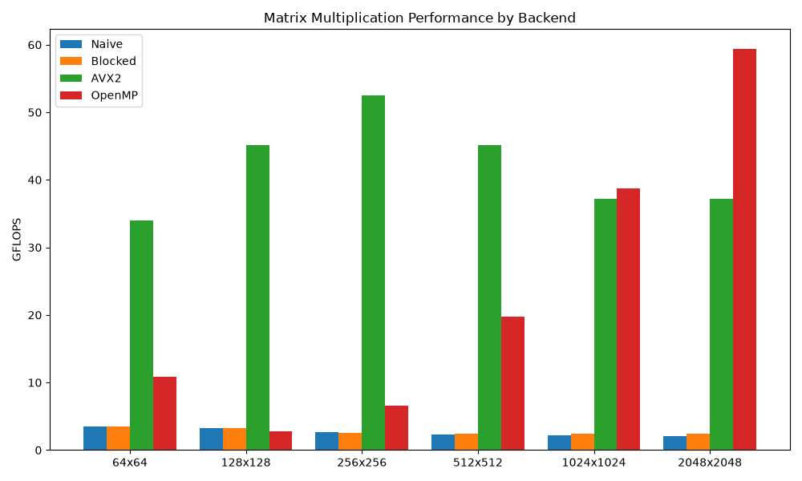

# Benchmark Report

This report presents performance measurements of HELIX on Matrix Multiplication (MatMul) operations - the largest bottleneck in neural networks.

## Test Environment

- **Operating System**: Linux
- **Compiler**: GCC/Clang (C++20)
- **Optimization Flags**: `-O3`, `-march=native`, `-flto` (Enabled only for Native build)
- **Measurement Method**: Each configuration runs 5 warm-up iterations, then takes the median of the next 30 iterations.
- **Comparison Baseline**: OpenBLAS (Assuming Peak theoretical: ~240 GFLOPS on the test configuration).

---

## Matrix Multiplication Results (1024x1024)

A $1024 \times 1024$ size requires approximately 2.14 billion operations (FLOPs). Below is the performance (GFLOPS) recorded on different Backends:



```text
Naive (2.15 GFLOPS)
██

Blocked (2.39 GFLOPS) - Speedup: 1.11x
██▎

OpenMP (37.37 GFLOPS) - Speedup: 17.55x
████████████████████████████████

AVX2 (35.44 GFLOPS) - Speedup: 14.82x
██████████████████████████████
```

### Why is the Blocked Backend weak?
Although Blocked MatMul (Tiling) was born to solve the Cache Miss problem, in HELIX, matrix $B$ is already transposed into $B\_T$ right at the Tensor layer. Therefore, the innermost loops for both $A$ and $B\_T$ access memory entirely contiguously (Contiguous Access). The Cache advantage of the Blocked algorithm is no longer significant, while it suffers a large overhead from 6 nested loops, which hinders the compiler from performing Loop Unrolling.

---

## Detailed Data Across Multiple Sizes

The table below details GFLOPS measurements across various matrix sizes.

| Size | Naive | Blocked | AVX2 | OpenMP |
| :--- | :--- | :--- | :--- | :--- |
| **64x64** | 3.55 | 3.51 | 30.11 | 0.17* |
| **128x128** | 3.27 | 3.28 | 45.84 | 5.92* |
| **256x256** | 2.54 | 2.56 | 52.03 | 8.85* |
| **512x512** | 2.30 | 2.46 | 46.89 | 21.04 |
| **1024x1024**| 2.15 | 2.39 | 35.44 | 37.37 |

*\* Note: Excessively small matrix sizes cause the OpenMP Thread Pool initialization overhead to outweigh the computation time, leading to lower performance compared to single-threaded execution.*

## Conclusion
- **Power of SIMD**: Utilizing the 256-bit YMM registers of AVX2 improves performance by ~15x compared to the Baseline on a single CPU core.
- **Micro-kernel Bottleneck**: The current AVX2 micro-kernel (`8x1`) only achieves `0.88 FMA/Load`, which is the reason we cap at ~50 GFLOPS instead of approaching 200+ GFLOPS. Implementing `4x4` or `6x16` micro-kernels (Register Blocking) will be the next optimization target.
