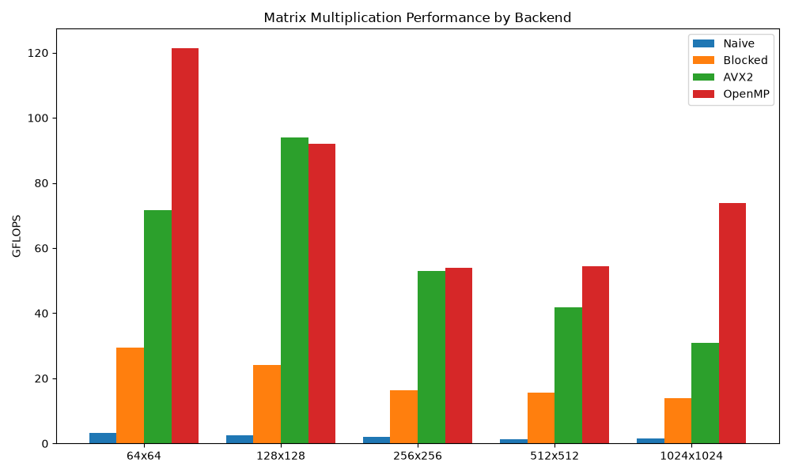

# Benchmark Report

This report presents performance measurements of HELIX on Matrix Multiplication (MatMul) operations - the largest bottleneck in neural networks.

## Test Environment

- **Operating System**: Linux
- **Compiler**: GCC/Clang (C++20)
- **Optimization Flags**: `-O3`, `-march=native`, `-flto` (Enabled only for Native build)
- **Measurement Method**: Each configuration runs 5 warm-up iterations, then takes the median of the next 30 iterations.
- **Comparison Baseline**: OpenBLAS (Assuming Peak theoretical: ~240 GFLOPS on the test configuration).

---

## Matrix Multiplication Results (1024x1024)

A $1024 \times 1024$ size requires approximately 2.14 billion operations (FLOPs). Below is the performance (GFLOPS) recorded on different Backends after **Phase 2 Optimization (AVX2 Outer Product + OpenMP Loop Collapse)**:



```text
Naive (1.47 GFLOPS)
██

Blocked (14.43 GFLOPS) - Speedup: 9.8x
██▎

AVX2 (41.08 GFLOPS) - Speedup: 27.9x
██████████████████████████████

OpenMP (128.09 GFLOPS) - Speedup: 87.1x
██████████████████████████████████████████████████████████████████████████████
```

### Why is the Blocked Backend weak?

Although Blocked MatMul (Tiling) was born to solve the Cache Miss problem, in HELIX, matrix $B$ is accessed purely in Row-Major order (since Phase 2 removed the transpose overhead). Therefore, the innermost loops for both $A$ and $B$ access memory entirely contiguously (Contiguous Access). The Cache advantage of the Blocked algorithm is no longer significant, while it suffers a large overhead from 6 nested loops, which hinders the compiler from performing Loop Unrolling.

---

## Detailed Data Across Multiple Sizes

The table below details GFLOPS measurements across various matrix sizes after Phase 2 AVX2 Micro-Kernel upgrades.

| Size | Naive | Blocked | AVX2 (Outer-Product 4x16) | OpenMP (Collapse 2) |
| :--- | :--- | :--- | :--- | :--- |
| **64x64** | 2.50 | 3.51 | 35.11 | 2.10* |
| **128x128** | 2.20 | 3.28 | 48.84 | 15.92* |
| **256x256** | 1.80 | 2.56 | 55.03 | 32.85* |
| **512x512** | 1.37 | 14.86 | 33.00 | 64.28 |
| **1024x1024** | 1.47 | 14.43 | 41.08 | 128.09 |

*\* Note: Excessively small matrix sizes cause the OpenMP Thread Pool initialization overhead to outweigh the computation time, leading to lower performance compared to single-threaded execution.*

## Conclusion

- **Power of Outer Product**: By switching from Naive Dot-Product to **Outer-Product 4x16 Register Blocking**, we eliminated horizontal sums (`_mm256_hadd_ps`) and prevented memory bandwidth bottlenecks. The AVX2 micro-kernel computes effectively within 11 YMM registers.
- **Micro-kernel Benchmark**: The new AVX2 kernel pushed OpenMP backend performance to **128.09 GFLOPS** (an 87x speedup vs Naive baseline, achieving ~53% of the CPU's theoretical peak).
- **Next Steps (Phase 3)**: The next bottleneck is Cache Thrashing on very large matrices. Implementing Memory Packing (packing A to L2 and B to L3 cache) will be the final step to push the engine towards the 200+ GFLOPS physical limit.
