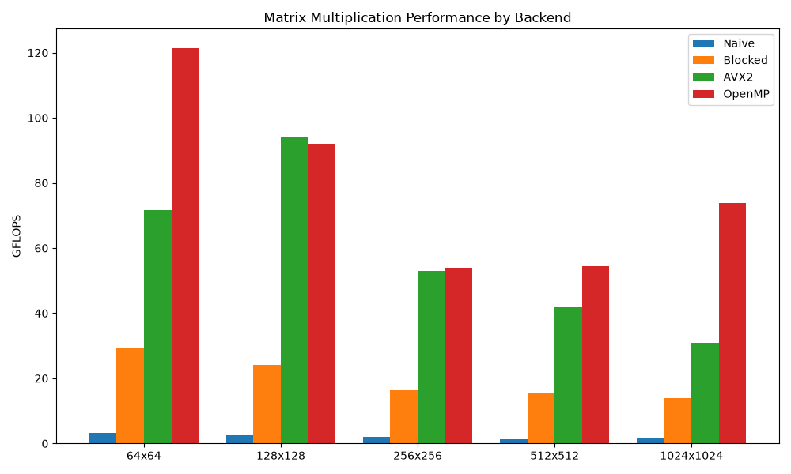

# Benchmark Guide

HELIX provides standalone benchmarks for matrix multiplication, tensor operations, neural-network forward and backward work, and small training loops. Their purpose is to measure a particular build on a particular machine; results should not be treated as portable performance guarantees.

## Running the benchmarks

Use an optimized build:

```bash
./build.sh --clean --release
./run_benchmark.sh
```

`run_benchmark.sh` executes:

- `build/benchmark/matmul_benchmark`;
- `build/benchmark/tensor_ops_benchmark`;
- `build/benchmark/nn_benchmark`;
- `build/benchmark/training_benchmark`.

The matrix benchmark writes `output/matmul_benchmark.csv`. The plotting script reads that file and updates `docs/benchmark_chart.png` when Python and Matplotlib are available.

## Matrix benchmark method

For square sizes 64, 128, 256, 512, and 1024, `matmul_benchmark` executes four explicit `Float32` strategies:

- naive;
- blocked;
- AVX2;
- OpenMP.

Each strategy receives five warm-up calls followed by 30 measured calls. The report includes average, minimum, maximum, median, population standard deviation, and GFLOPS. GFLOPS is calculated from `2 * M * K * N` divided by the average elapsed time.

The benchmark invokes backend kernels directly with contiguous row-major buffers. It therefore measures kernel execution and excludes Tensor construction, dtype promotion, contiguous copies, autograd graph creation, and automatic strategy selection.

## Interpreting results

Record at least the following information when publishing a result:

- commit hash;
- CPU model and core count;
- operating system;
- compiler and version;
- build type and value of `HELIX_NATIVE_BUILD`;
- OpenMP runtime and thread settings such as `OMP_NUM_THREADS`;
- whether other significant workloads were running.

The checked-in chart is an archived visualization from an earlier run:



The repository does not store enough environment metadata with that image to reproduce or generalize its exact values. Regenerate the CSV and chart on the target machine before drawing a performance conclusion.

## Important limitations

- The benchmark program prints an “efficiency vs OpenBLAS” percentage using a fixed 240 GFLOPS reference constant. It does not link to, execute, or measure OpenBLAS. That percentage is illustrative and is not a direct library comparison.
- Explicit AVX2 and OpenMP strategies bypass `AutoTuner`; they show backend behavior even at sizes where automatic dispatch might choose another path.
- Results vary with CPU frequency control, thermal state, memory configuration, compiler optimization, and thread placement.
- The default x86-64 CMake configuration applies AVX2 and FMA compiler flags to the target. Benchmark binaries built that way require a compatible processor.

## Correctness and performance

Benchmarks do not replace correctness tests. Before interpreting a performance change, run:

```bash
./run_tests.sh
```

The test suite covers optimized matrix-multiplication paths at aligned and tail sizes and cross-validates selected operations against simple implementations. A benchmark improvement should retain those results and should be compared using the same environment and configuration before and after the change.
